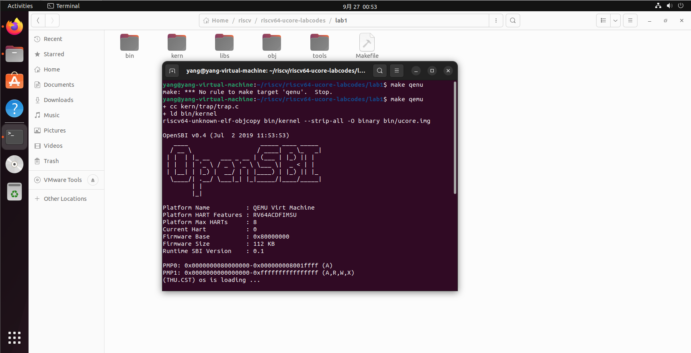
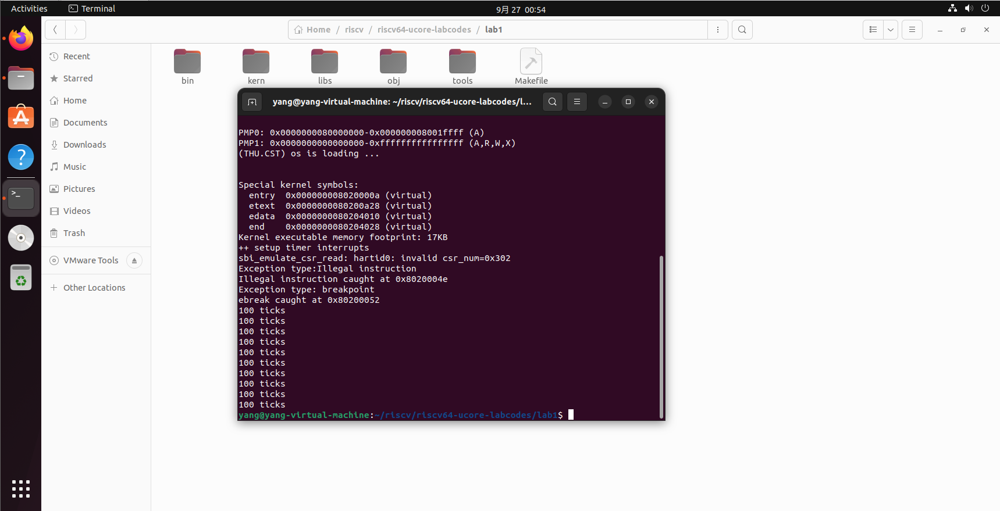
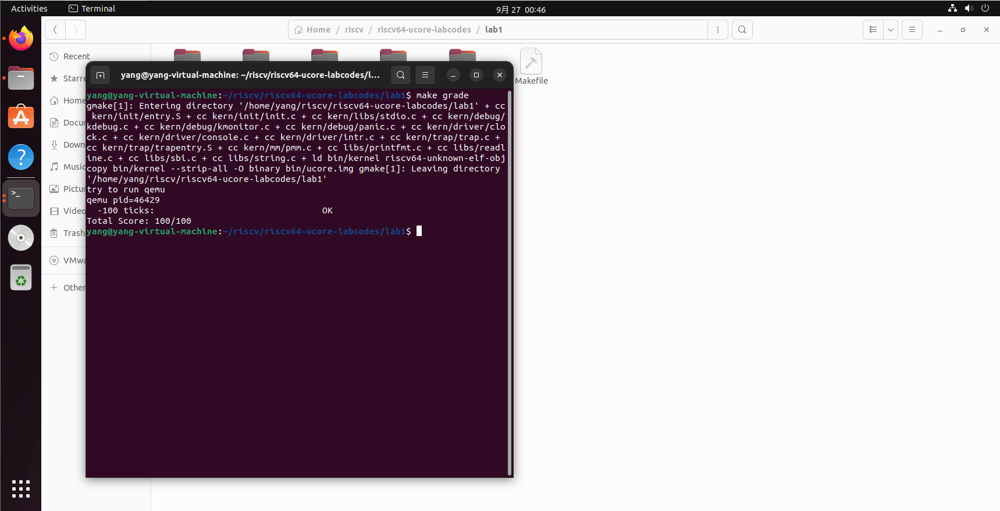

# 操作系统lab01实验报告
### 实验目的

实验1主要讲解的是中断处理机制。操作系统是计算机系统的监管者，必须能对计算机系统状态的突发变化做出反应，这些系统状态可能是程序执行出现异常，或者是突发的外设请求。当计算机系统遇到突发情况时，不得不停止当前的正常工作，应急响应一下，这是需要操作系统来接管，并跳转到对应处理函数进行处理，处理结束后再回到原来的地方继续执行指令。这个过程就是中断处理过程。

本章你将学到：

1.riscv 的中断相关知识

2.中断前后如何进行上下文环境的保存与恢复

3.处理最简单的断点中断和时钟中断

### 练习
#### 练习1：理解内核启动中的程序入口操作。
阅读 kern/init/entry.S内容代码，结合操作系统内核启动流程，说明指令 la sp, bootstacktop 完成了什么操作，目的是什么？ tail kern_init 完成了什么操作，目的是什么？

`kern/init/entry.S`是`OpenSBI`启动时最先执行的一段代码，在该段代码中，完成了对于内核栈的分配，然后跳转到内核初始化函数进行执行。

1.`la sp, bootstacktop`
该指令将`bootstacktop`这个标签的地址加载给`sp`栈顶寄存器，从而实现内存栈的初始化,设置了内核栈的起始地址，使得栈指针指向内核栈的顶部。

2.`tail kern_init`
该指令通过尾调用的方式跳转执行`kern_init`这个函数进行内核的初始化。通过尾调的方式将控制权传递给`kern_init`。使用`tail`指令，在初始化完成后不需要返回到`kern_entry`。


#### 练习2：完善中断处理 （需要编程）

请编程完善trap.c中的中断处理函数trap，在对时钟中断进行处理的部分填写kern/trap/trap.c函数中处理时钟中断的部分，使操作系统每遇到100次时钟中断后，调用print_ticks子程序，向屏幕上打印一行文字”100 ticks”，在打印完10行后调用sbi.h中的shut_down()函数关机。

要求完成问题1提出的相关函数实现，提交改进后的源代码包（可以编译执行），并在实验报告中简要说明实现过程和定时器中断中断处理的流程。实现要求的部分代码后，运行整个系统，大约每1秒会输出一次”100 ticks”，输出10行。

```
clock_set_next_event();
if(++ticks&&ticks%TICK_NUM==0){
    print_ticks();
    num++;
}
if(num==10){
    sbi_shutdown();
}            
```

运行结果在实验报告最后


#### 扩展练习 Challenge1：描述与理解中断流程

回答：描述ucore中处理中断异常的流程（从异常的产生开始），其中mov a0，sp的目的是什么？SAVE_ALL中寄寄存器保存在栈中的位置是什么确定的？对于任何中断，`__alltraps` 中都需要保存所有寄存器吗？请说明理由。

流程：
1. 程序产生异常中断
2. 触发中断时，首先由`sepc`保存异常的`pc`，然后`pc`设置为`stvec`
3. 进入中断入口点，然后保存上下文并封装，进入`trap()`函数
4. 在该函数内调用`trap_dispatch()`函数，判断中断的类型。再根据不同的中断类型进行不同处理，最后跳转回到trapentry.S中恢复上下文，然后把`sepc`的值赋值给`pc`,返回到中断发生的位置继续执行。

在__alltraps中，move a0, sp的目的是将当前的栈指针（sp）保存到寄存器a0中，然后将其作为参数传递给trap函数。trap函数可能需要知道当前的中断上下文（特别是栈的位置），以便进行进一步的处理或调试。

在SAVE_ALL宏中，寄存器保存在栈中的位置是通过计算与栈指针（sp）的偏移来确定的。每个寄存器都被保存在栈上特定的偏移位置，这些位置是通过REGBYTES（假设是寄存器大小，如8字节对于64位RISC-V）乘以一个索引来计算的。例如，x0保存在0*REGBYTES(sp)，x1保存在1*REGBYTES(sp)，依此类推。

对于任何中断，在__alltraps中通常都需要保存大部分关键的寄存器。但是跳过了x2寄存器。


#### 扩增练习 Challenge2：理解上下文切换机制
回答：在trapentry.S中汇编代码 csrw sscratch, sp；csrrw s0, sscratch, x0实现了什么操作，目的是什么？save all里面保存了stval scause这些csr，而在restore all里面却不还原它们？那这样store的意义何在呢？


1. `csrw sscratch, sp`：用于将寄存器中的值写入 CSR。将栈指针（`sp`）的值写入 `sscratch` CSR。`sscratch` 是一个可供操作系统在中断或异常发生时使用的临时存储寄存器。
2. `csrrw s0, sscratch, x0`：用于读取一个 CSR 的值，然后将一个新的值写入同一个 CSR，并且将原来的值返回到一个通用寄存器中。 这条指令执行以下操作：
   首先，将 `sscratch` CSR 中的值读取出来，存储到 `s0` 寄存器中。这里，`sscratch` CSR 之前存储的是栈指针 `sp` 的值。
   然后，将 `x0` 寄存器的值写入 `sscratch` CSR，从而实现清零操作。

这种操作用于中断或异常处理中，以保存和恢复现场。当中断发生时，操作系统需要保存当前的上下文（即寄存器的状态），以便在中断处理完成后能够恢复到中断发生前的状态。通过将栈指针的值保存到 `sscratch` CSR，然后在中断处理程序中再将其值恢复到真正的栈指针寄存器，可以实现上下文的保存和恢复。
在中断处理程序中，`csrrw` 指令用于确保 `sscratch` CSR 在中断处理期间不会保存错误的值，因为在中断处理程序中可能会使用栈，这时 `sp` 的值可能会改变。通过将 `sscratch` 清零，可以确保在中断处理完成后，`sscratch` CSR 不会包含一个错误的栈指针值，从而避免在返回时恢复错误的上下文。


 `stval` 寄存器保存了导致异常的访存地址，这个值对于异常处理来说是必要的，但是在异常处理完成后，这个值就不再需要了，因此不需要恢复。
 `scause` 寄存器记录了异常或中断的原因，在异常处理过程中，这个信息被用来决定采取什么样的处理措施。一旦处理完异常，这个值也就没有保留的必要了，因为下一次异常可能会有不同的原因。


#### 扩展练习Challenge3：完善异常中断

编程完善在触发一条非法指令异常 mret和，在 kern/trap/trap.c的异常处理函数中捕获，并对其进行处理，简单输出异常类型和异常指令触发地址，即“Illegal instruction caught at 0x(地址)”，“ebreak caught at 0x（地址）”与“Exception type:Illegal instruction"，“Exception type: breakpoint”。

在kern/trap/trap.c补全两段异常处理的代码

```
        case CAUSE_ILLEGAL_INSTRUCTION:
             // 非法指令异常处理
             /* LAB1 CHALLENGE3   YOUR CODE :  */
            /*(1)输出指令异常类型（ Illegal instruction）
             *(2)输出异常指令地址
             *(3)更新 tf->epc寄存器
            */
	    cprintf("Exception type:Illegal instruction\n");
	    cprintf("Illegal instruction caught at 0x%08x\n", tf->epc);
	    tf->epc += 4; 
		    
            break;
        case CAUSE_BREAKPOINT:
            //断点异常处理
            /* LAB1 CHALLLENGE3   YOUR CODE :  */
            /*(1)输出指令异常类型（ breakpoint）
             *(2)输出异常指令地址
             *(3)更新 tf->epc寄存器
            */
	    cprintf("Exception type: breakpoint\n");
	    cprintf("ebreak caught at 0x%08x\n", tf->epc);
	    tf->epc += 2; 
            
            break;
       
```

在kern/init/init.c添加
```
    asm("mret");
    asm("ebreak");
```
输出异常指令的地址时，利用0x%08x格式化字符串，08表示输出8个字符，x代表16进制。

非法指令异常处理结束后，tf->epc的值加了4，因为导致该异常的指令mret的长度为4字节。
断点异常处理结束后，tf->epc的值加了2，因为导致该异常的指令ebreak的长度是2字节，为了保存指令的四字节对齐，就只加2。

运行结果如图



 `make grade `后


### 知识点
1.异常：程序执行中内部指令执行时出现的错误，例如发生缺页、非法指令等。

2.中断：CPU 的执行过程被外设发来的信号打断，例如时钟中断等。

